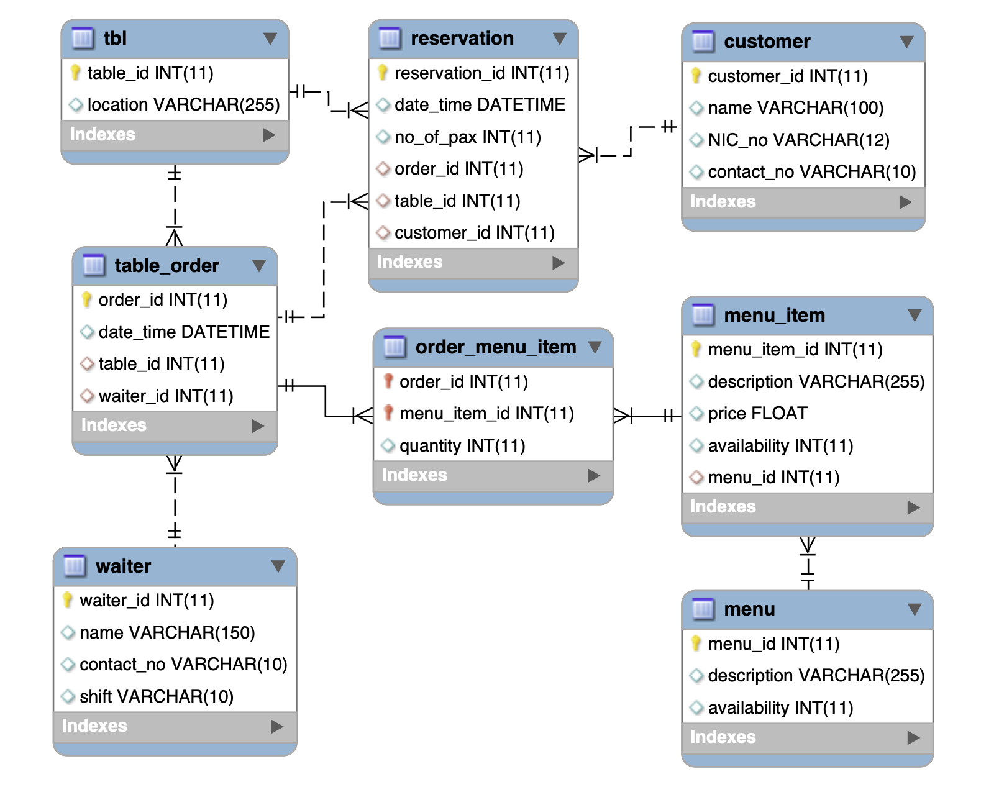

## Logical Schema for Restaurant Table Order Booking

Below is the logical schema (ER-Diagram) representing the process of booking a table at a restaurant:

## Useful Resources on Database Schemas

For more information about database schemas, you can visit the following resources:

- [Introduction to Schemas - Prisma](https://www.prisma.io/dataguide/intro/intro-to-schemas)
- [Database Schema Guide - Lucidchart](https://www.lucidchart.com/pages/database-diagram/database-schema)
- [What are Database Schemas - Educative Blog](https://www.educative.io/blog/what-are-database-schemas-examples)
- [Database Schema - IBM](https://www.ibm.com/topics/database-schema)
